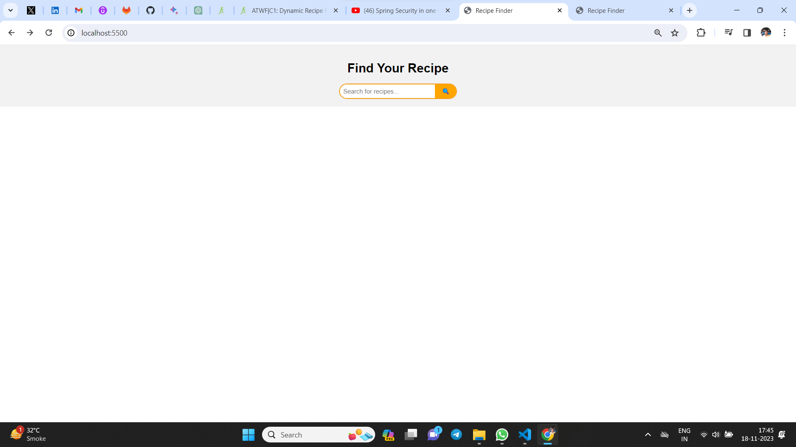
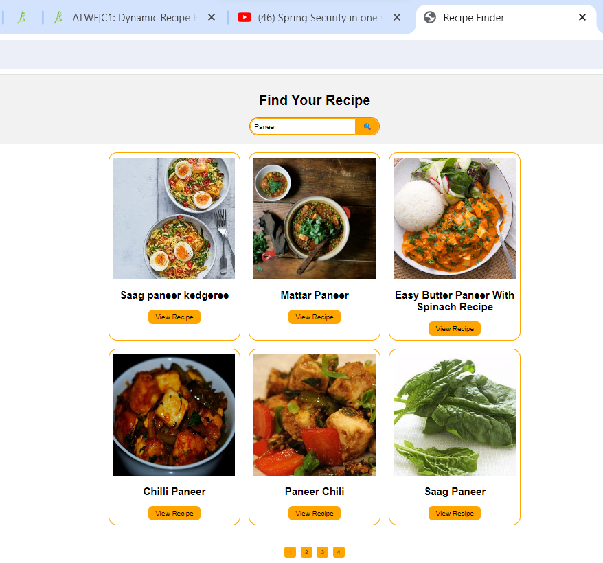
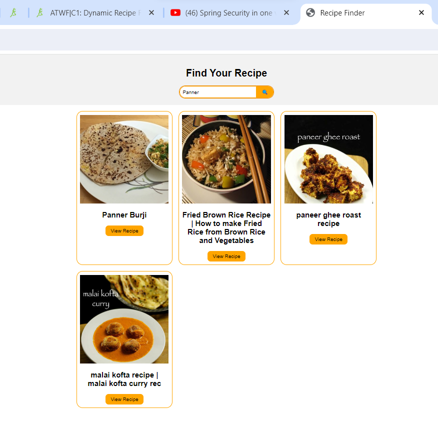
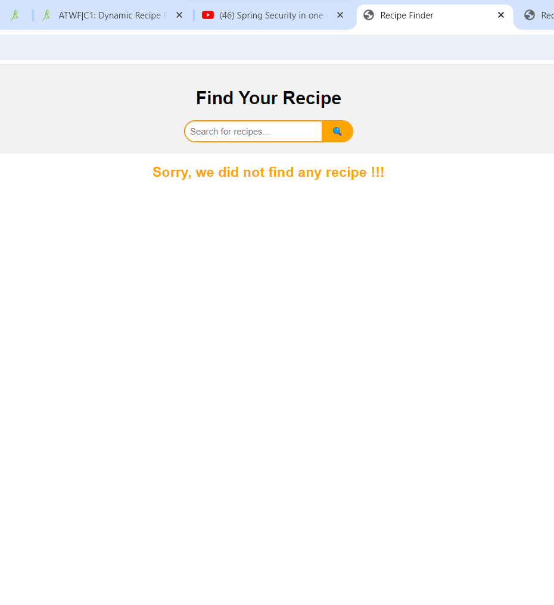

# Recipe Finder

## Description

Welcome to the Recipe Finder app! This application allows users to search for various recipes based on ingredients or dish names. Users can explore a wide range of recipes, view detailed instructions, and save their favorite recipes for later reference. This README provides an overview of the app and instructions on how to set it up on your device.

## Project Links

- GitHub: [Recipe Finder Repository](https://github.com/your-username/recipe-finder)
- Live: [Recipe Finder Application](https://saurabhkumarr99.github.io/Recipe-Finder/)

## Table of Contents

- [Features](#features)
- [Getting Started](#getting-started)
- [Usage](#usage)
- [Code Structure](#code-structure)
- [Screenshots](#screenshots)
- [Author](#author)

## Features

- **Search Recipes:** Search for recipes using ingredients or dish names.
- **Detailed Instructions:** View detailed instructions, ingredients, and cooking steps for each recipe.
- **Pagination:** Navigate through multiple pages of search results for more recipes.
- **User-Friendly Interface:** Enjoy a simple and intuitive user interface for a smooth experience.


## Getting Started

### Prerequisites

Follow these steps to run the Blog App locally:

1. **Unzip the Recipe Finder App:**

2. **Navigate to the project directory:**

   ```bash
   cd RecipeFinderApp
   ``` 
 

2. **Run:**

   ```bash
    Open Live Server
   ``` 

3. **Click :**
   http://localhost:5500/


## Usage

- **Search Recipes:** Enter keywords or ingredients in the search bar to find recipes matching your criteria.
- **View Recipe Details:** Click on a recipe card to view detailed instructions, ingredients, and cooking steps.
- **Pagination:** Navigate through multiple pages of search results using the pagination buttons at the bottom.
- **Explore New Dishes:** Experiment with new dishes by exploring different recipes available on the app.

## Code Structure

The project follows a structured directory layout for better organization:

- **Dynamic Recipe Finder**: 
  - `index.html/`
  - `script.js`
  - `styles.css`


- **ScreenShots**: Folder conatining screenshots here.

- `README.md`: This file, which provides an overview of the project's structure and usage instructions.

## Screenshots

<p align="center">
  
  
  
  
</p>


## Author

- SAURABH KUMAR RAI

